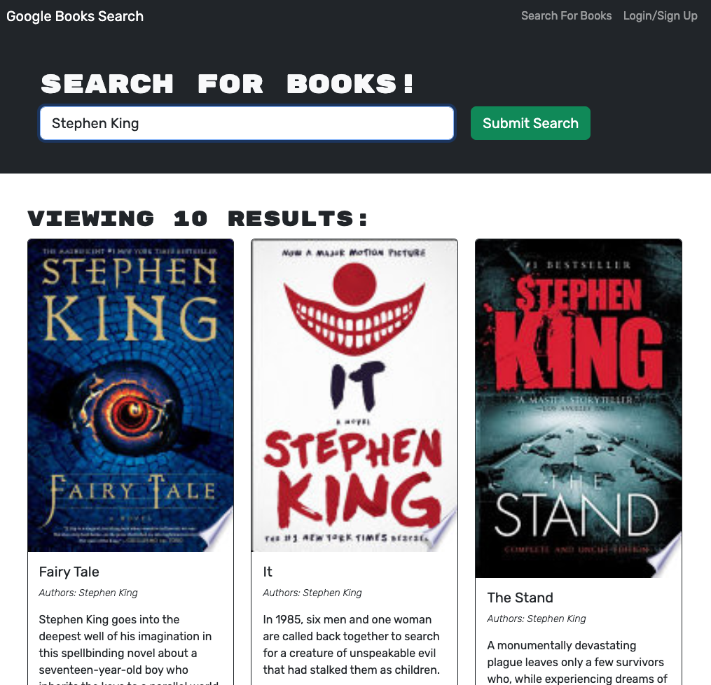

# apollo-book-hunt

[](https://opensource.org/licenses/mit)

## Table of Contents

- [Description](#description)
- [Features](#features)
- [Getting Started](#getting-started)
- [Technologies](#technologies-used)
- [Screenshot](#screenshot)
- [API Documentation](#api-documentation)
- [Contributing](#contributing)
- [Credits](#credits)
- [Questions](#questions)
- [License](#license)

## Description

Apollo Book Hunt is a full-stack web application that allows users to search for books using the Google Books API, save their favorite books, and manage their reading list. The application is built using the MERN stack (MongoDB, Express, React, Node.js) and utilizes GraphQL with Apollo Server for efficient data fetching and manipulation.

## Features

- User authentication: Users can create an account, log in, and log out securely.
- Book search: Users can search for books using the Google Books API and view book details.
- Save books: Logged-in users can save books to their reading list for future reference.
- Manage reading list: Users can view and remove books from their saved reading list.
- Responsive design: The application is designed to work seamlessly across different devices and screen sizes.

## Technologies Used

- MongoDB: A NoSQL database used to store user and book data.
- Express: A web application framework for Node.js used to build the server-side API.
- React: A JavaScript library for building user interfaces, used for the client-side application.
- Node.js: A JavaScript runtime environment used to run the server-side code.
- GraphQL: A query language for APIs, used to define the schema and resolvers for efficient data fetching and manipulation.
- Apollo Server: A GraphQL server implementation that integrates with Express and provides a set of tools for building GraphQL APIs.
- JWT (JSON Web Tokens): Used for user authentication and authorization.
- Mongoose: An Object Data Modeling (ODM) library for MongoDB and Node.js, used to define database schemas and interact with the database.
- Vite: A fast build tool used for the client-side development server and bundling.

## Getting Started

To run the Apollo Book Hunt application locally, follow these steps:

1. Clone the repository:

    `git clone https://github.com/CookingMeister/apollo-book-hunt.git`

2. Install the dependencies for both the client and server:

    `npm install`

3. Set up the environment variables:

    - Create a .env file in the server directory.
    - Add the following variables to the .env file:

        ```code
        MONGODB_URI=your-mongodb-connection-string
        JWT_SECRET=your-jwt-secret
        ```

4. Start the development server:

    `npm run develop`

5. Open your browser and visit [http://localhost:5173](http://localhost:5173) to access the Apollo Book Hunt application.

## Screenshot



## API Documentation

The Apollo Book Hunt API is built using GraphQL and follows the GraphQL schema defined in `server/schemas/typeDefs.js`. The available queries and mutations are:

- `me`: Query the currently authenticated user.
- `login`: Authenticate a user with their email and password.
- `addUser`: Create a new user account.
- `saveBook`: Save a book to the user's reading list.
- `removeBook`: Remove a book from the user's reading list.

For detailed information about the API schema and usage, please refer to the GraphQL schema file.

## Contributing

Contributions to the Apollo Book Hunt project are welcome! If you find any bugs, have feature requests, or want to contribute improvements, please open an issue or submit a pull request.

## Credits

This app was created by [CookingMeister](https://github.com/CookingMeister) on criteria from the University of New Brunswick's [edX Coding Bootcamp](https://unb.ca/cel/bootcamps/coding.html) program with starter souce code from [here](https://github.com/coding-boot-camp/solid-broccoli). Program materials, [MDN Web Docs](https://developer.mozilla.org/en-US/docs/Learn/Tools_and_testing/Client-side_JavaScript_frameworks/React_getting_started) and [Apollo Client docs](https://www.apollographql.com/docs/react/get-started) were referenced for this app.

## Questions

If you have an questions about this app, please contact me at [LinkedIn](https://www.linkedin.com/in/shawn-meister-bb646b29a/). More of my work can be viewed at [Github](https://github.com/CookingMeister).

## License

[](https://opensource.org/licenses/mit)

This project is licensed under the [MIT License](LICENSE).

## Acknowledgements

- [Google Books API](https://developers.google.com/books)
- [Apollo GraphQL](https://www.apollographql.com/)
- [MERN Stack](https://www.mongodb.com/mern-stack)